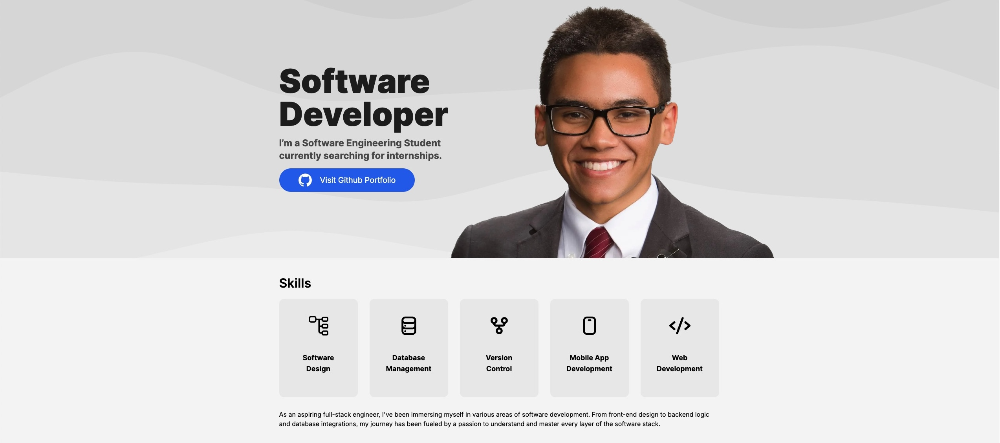
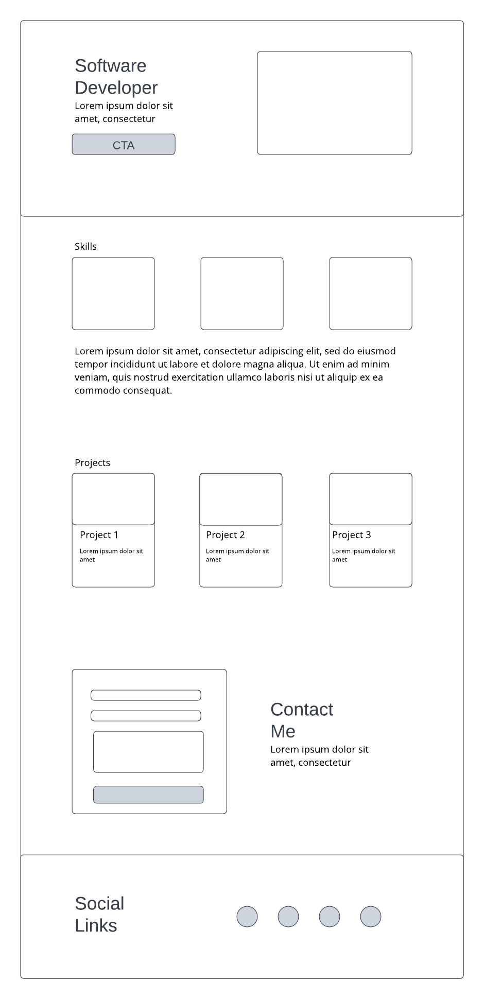
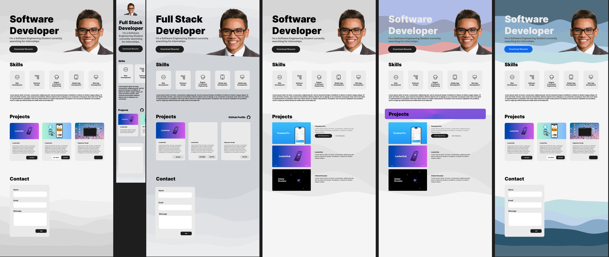

# Portfolio

This portfolio showcases my work and projects. It's designed to be responsive, fast, and easy to navigate, leveraging the power of SvelteKit and the flexibility of Tailwind CSS.


## Installation

To run this project locally, follow these steps:

1. Clone the repository:
   ```bash
   git clone https://github.com/Calesi19/Portfolio.git
   ```
2. Cd into repository:
    ```bash
    cd your-repo-name
    ```
3. Install dependencies:
    ```bash
    npm install
    ```

## Developing & Building

Once you've created a project and installed dependencies, start a development server:

```bash
npm run dev
```

To create a production version of your app:

```bash
npm run build
```

## Result (Production)

You can visit the website at: https://www.carloslespin.com/


## Development Process

When developing for this website, I wanted the site to be simple and resemble a landing page a company would use.

|       |       |
| -------------- | -------------- |

## Future Work

* This iteration of my porftolio feels too static. Add fade in animations for elements scrolling into view.

* Use the GitHub API to load the projects instead of having three hardcoded projects.

* A certificate section.

* Endorsements section.

* New iterations could have an even simpler layout than this.

* Lazy loading.